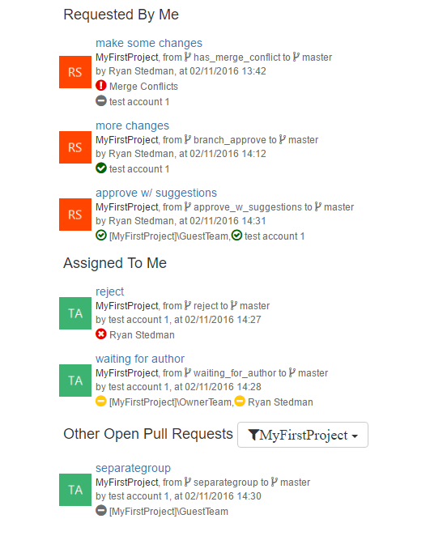
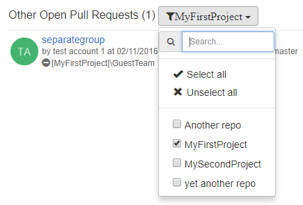
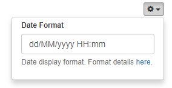
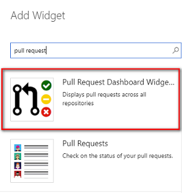
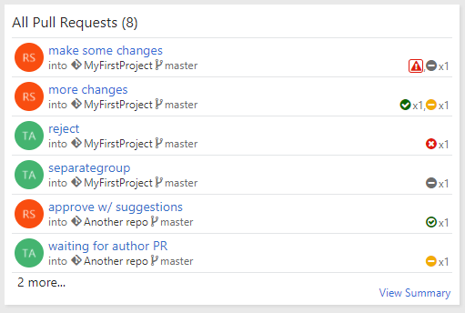

# Pull Request Dashboard

When working with a codebase that can span dozens of different code repositories, it can be difficult to keep track of the pull requests that you have created, or ones created by others that you may need to review.  This extension solves this issue by providing a place that pull requests across all repositories can be viewed on a single page.

## Pull Request Dashboard Code Hub

This extension adds a new hub to the code section of Visual Studio Team Services/Team Foundation Service for viewing all active pull requests across all repositories.

### Pull Request Categories

The hub queries for all active pull requests, and groups them into several different categories.  Each category sorts pull requests, showing the oldest pull requests first.

* Requested by me - Pull requests requested by the current user
* Assigned to me - Pull requests created by another user that have the current user assigned as a reviewer
* Assigned to my team - Pull requests created by another user that have a team assigned as a reviewer that the current user is directly or indirectly a member of.
    * Indirect team membership means that a team that the current user is not a member of, but one of the teams that the user *is* a member of, is a member of the team (ex. User memberof Team1 memberof Team2).  This allows for pull requests assigned to "virtual" teams: a team made up of several other teams (ex. "UX Team" is made up of "UX Team 1" & "UX Team 2").
    * **Note**: Currently only supported for on-premises Team Foundation Server installations, due to APIs used that are currently unavailable in Visual Studio Team Services
* Other Open pull requests - All other active pull requests that don't fall into any of the above categories

### Pull Request Details
Each pull request displayed shows a number of useful pieces of information.

* PR Title & Author
* Repository name, from branch & to branch
* Merge conflicts - merge conflicts indicator displayed only if the PR has merge conflicts.
* Drafts - draft PR indicator if the PR is in draft state
* Reviewers
    * Each reviewer on the PR has an icon next to their name indicating their vote
        * Solid Green Circle Checkmark = Approved
        * Hollow Green Circle Checkmark = Approved With Suggestions
        * Yellow Circle Dash = Waiting for Author
        * Red Circle X = Rejected
    * If a reviewer is marked as required on a PR, an asterisk is added next to their name (ex "User1*" indicates that User1 is a required reviewer on the PR)

### Filtering by Repository

For an organization with dozens of different code repositories, an individual developer may only actively work in a handful of those repos, and may not care about PRs in other repos.  Next to the Other Pull Requests group header is a filter button that allows users to select just the repositories that they are interested in, and the Other Open Pull Requests category will dynamically update to show PRs only in repos selected.  Filter selections will be saved, allowing subsequent page loads to keep the user's filter selection.

### Settings

At the top right of the dashboard plugin is a button which will drop down user-specific settings.  The settings supported are:

* Date Format - specifies the format to display PR creation date timestamp.  Default is "dd/MM/yyyy HH:mm".
* All Projects - show pull requests from repositories across all projects.

## Pull Request Dashboard Widget

This extension also adds a new widget that can be added to any VSTS dashboard.

### Widget Display

The widget shows a more compact version of the pull request details, compared to the code hub dashboard.  The differences are:

* The name of the person that created the pull request, as well as the date created is not displayed.
    * That information is still accessible as a tooltip by hovering your cursor over the PR creators image in the widget.
* The individual names of reviewers are not displayed for each PR.  Instead, the icons indicating the type of vote is shown, with the number of reviewers that have responded with same vote next to the icon.
    * Hovering over the vote icon in the widget will display the list of reviewers that responded with that vote.

### Widget Configuration

The widget allows configuration of the size, as well as the category of pull requests to display.  The categories are:

* Requested By Me - Pull requests created by the current user.
* Assigned To Me - Pull requests where the current user is assigned as a reviewer.
* Assigned To My Team - Pull requests assigned to the team of the current user.
* All - All pull requests, with no filtering applied.

## Source Code and Issue Tracking

Source code for this extension can be found in the [tfs-pullrequest-dashboard](https://github.com/rstedman/tfs-pullrequest-dashboard) GitHub Repository.  Please report any issues found with this extension to the issues section of the GitHub repository [here](https://github.com/rstedman/tfs-pullrequest-dashboard/issues).

## Change Log

* (23/05/2019) 2.1.0 - feature: add indicator for draft PRs. Also change location of conflict indicator to be consistent.
* (23/04/2019) 2.0.6 - bug fix: the dashboard widget stopped loading in Azure Devops 2019
* (18/11/2018) 2.0.5 - bug fix: navigating to a PR from this extension would result in an error when using dev.azure.com.
* (09/09/2018) 2.0.4 - bug fix: dashboard only shows top 101 active PRs.  Update that to top 1000 active PRs. 
* (22/02/2018) 2.0.2 - bug fix: dashboard widget breaks with the new dashboards experience VSTS setting enabled.
* (20/12/2017) 2.0.1 - bug fix: when showing pull requests across all projects in a TFS deployment.
* (17/12/2017) 2.0.0
    * Added VSTS dashboard widget
    * Update pull request display layout - more compact & more in line with how VSTS displays pull requests in other views.
    * More efficient querying of pull requests - faster load time.
* (01/10/2017) 1.2.0 - Added user setting to show PRs from repos across all projects.  Default behavior still shows PRs from the current project.
* (24/06/2017) 1.1.1 - don't show PRs in "Assigned To My Team" if also "Assigned To Me".
* (17/06/2017) 1.1.0 - added date format user setting
* (03/11/2016) 1.0.1 - bug fix: navigating to a PR would open the PR in the plugin iframe, instead of navigating the parent page
* (02/11/2016) 1.0.0 - initial release
